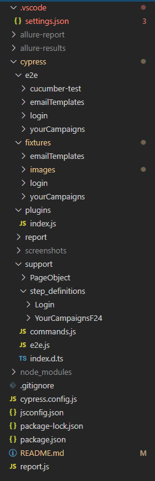
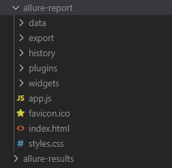
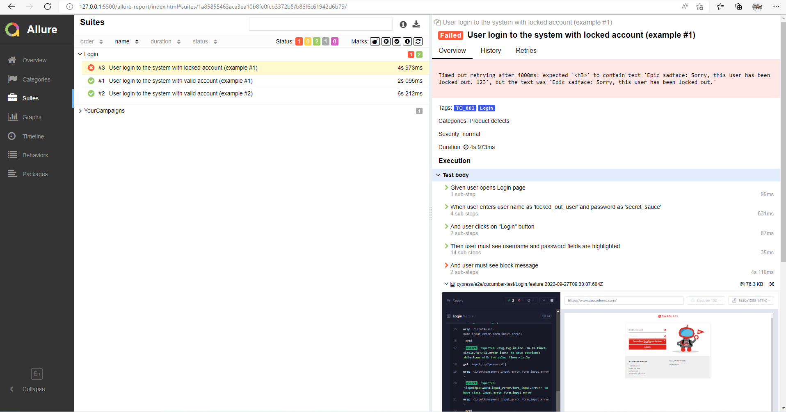
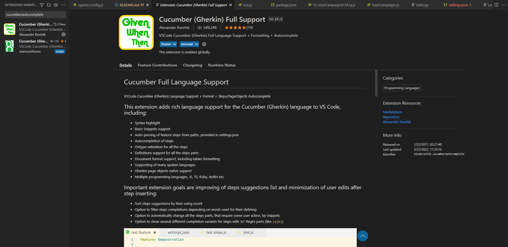

# Cypress base source code

# Cypress Automation Test Guideline

Behavioural Driven Development **(BDD)** automation framework using Java, Selenium, Cucumber, TestNG, Maven, PhantomJS

## Tools and Technologies Used
1. Language: Javascript
2. Automation Tool: Cypress
3. BDD Approach: Cucumber
4. Reporting: [Multiple Cucumber HTML Reporter](https://www.npmjs.com/package/multiple-cucumber-html-reporter)
5. Follows "Page Object Model"
6. Supports multiple browsers and no need to download drivers manually

## Features of Framework
1. BDD framework using Cucumber. Feature files can be written easily using Given, When, Then etc.
2. Browser (Chrome/Firefox) can be configured at run time from command line (or Continuous Integration tool, if configured).
3. Tests can run in headless browser (PhantomJS) by passing a parameter at run time.
4. Screenshot would be taken if any scenario failed and saved under **screenshots" folder.
5. HTML report gets generated after each test run and can be found /cypress/report/html-report/index.html

## Project Structure

**cypress.config.js** : Cypress configuration and settings

**jsconfig.json** : Javascript configuration and settings

**package.json** : Project configuration and settings

**README.md** : Documentation include guideline, coding convention, etc.

**folder: fixtures** : Test data and input

**folder: report** : Test reports

**folder: download** : The download files will be stored here

**folder: screenshots** : Scenario failed screenshots will be stored here

**folder: cucumber-test** : It contains all different features (tests) files.

**folder: step_definitions** : It contains all different step definitions (test steps) files.

**folder: PageObject** : It contains all page objects files.

## Test Report ##

Once test execution is completed, go to /cypress/report/html-report/cucumber-report folder and open index.html file

You can see the test results at different level

# Setting Up Project

## Installing necessary tools

1) Clone automation source by using either **SourceTree** or **GitExtensions** for your convenience, steps are as below:

    2.1) Source Tree, download and install SourceTree to clone github project at: https://www.sourcetreeapp.com/

   - Clone automation project by using https: https://github.com/myngo-ptn/cypressbase.git
   
3) Install Visual Studio Code at: https://code.visualstudio.com/download
4) Install cucumber extension on Visual Studio Code. Open View > Extensions > type cucumber and install
   

## Test Execution
Every cucumber test case MUST have a tag name, for e.g. @TC_001
   

To run all available test cases (all tags) in automation project, execute following command:

**$ npx cypress open**

To run tests headlessly (this mode is used for executing test in background - not open web browser)

**$ npm run test**

